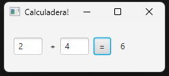
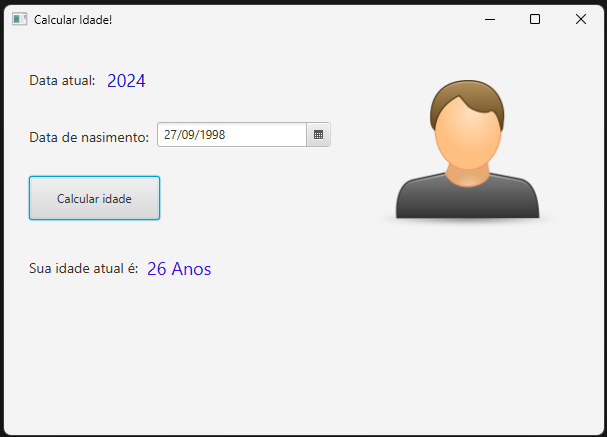

# 📗 Sexta Aula - Tipos Primitivos e Conversões em Java

Nesta aula, aprendemos sobre os **tipos primitivos** da linguagem **Java**, **classes invólucro**, e como realizar **conversões de dados**. Além disso, vimos como utilizar os comandos de saída no console e fazer leitura de dados com a classe **Scanner**. Ao final, desenvolvemos dois **pequenos aplicativos com JavaFX** para colocar os conceitos aprendidos em prática.

---

## 🎯 Tipos Primitivos do Java

Os tipos primitivos do Java são divididos em três categorias principais:

### 🔢 Numéricos
- Inteiros:
  - **byte**: armazena números inteiros de -128 a 127 (1 byte).
  - **short**: armazena números inteiros de -32.768 a 32.767 (2 bytes).
  - **int**: armazena números inteiros de -2<sup>31</sup> a 2<sup>31</sup>-1 (4 bytes).
  - **long**: armazena números inteiros de -2<sup>63</sup> a 2<sup>63</sup>-1 (8 bytes).
- Reais:
  - **float**: números de ponto flutuante com precisão simples (4 bytes).
  - **double**: números de ponto flutuante com precisão dupla (8 bytes).

### ✍️ Texto
- **char**: armazena um caractere Unicode, como `'A'` ou `'A'` (2 bytes).

### ⚙️ Lógico
- **boolean**: armazena **true** ou **false** (1 bit).

---

## 🛠️ Classes Wrapper

Além dos tipos primitivos, o Java oferece **classes invólucro** que encapsulam esses tipos. Essas classes são úteis para converter tipos, realizar operações avançadas e criar objetos representando valores primitivos. 

### 🔍 Exemplos de Classes Wrapper:
- **Boolean**, **Character**, **Byte**, **Short**, **Integer**, **Long**, **Float**, **Double**

#### Exemplo de Uso:
```java
int numero = 42;
Integer numeroWrapper = Integer.valueOf(numero); // Converte primitivo para Wrapper
int numeroPrimitivo = numeroWrapper.intValue(); // Converte Wrapper para primitivo
```

---

## 📤 Saída de Dados

O Java oferece três comandos principais para exibir mensagens no console:

### 📃 Comandos de Saída:
- **`System.out.println`**: imprime uma mensagem e pula para a próxima linha.
- **`System.out.print`**: imprime a mensagem sem mudar de linha.
- **`System.out.printf`**: permite formatar a saída, similar ao `printf` em C.

#### Exemplo:
```java
System.out.println("Olá, Mundo!");
System.out.print("Esta é uma mensagem sem quebra de linha. ");
System.out.printf("O número formatado é: %.2f", 123.456);
```

---

## 📥 Leitura de Dados

Para capturar entradas do usuário via teclado, utilizamos a classe **Scanner**. Esta classe pertence ao pacote **java.util**, sendo necessário importá-la:
```java
import java.util.Scanner;
```

### Métodos Comuns do Scanner:
- **`nextInt()`**: captura números inteiros.
- **`nextFloat()`**: captura números reais.
- **`nextLine()`**: captura texto.

#### Exemplo de Uso:
```java
import java.util.Scanner;

public class LeitorDados {
    public static void main(String[] args) {
        Scanner entrada = new Scanner(System.in);
        
        System.out.print("Digite seu nome: ");
        String nome = entrada.nextLine();
        
        System.out.print("Digite sua idade: ");
        int idade = entrada.nextInt();
        
        System.out.println("Olá, " + nome + ", você tem " + idade + " anos.");
    }
}
```

---

## 🔄 Conversões de Dados

Para realizar conversões entre tipos primitivos ou entre Strings e números, usamos as **classes invólucro** e seus métodos estáticos.

### Métodos Úteis:
- **`Integer.parseInt(String)`**: converte uma string para um número inteiro.
- **`Float.parseFloat(String)`**: converte uma string para um número de ponto flutuante.
- **`toString()`**: converte um valor em string.

#### Exemplo de Conversão:
```java
String texto = "42";
int numero = Integer.parseInt(texto); // Converte String para int
String textoConvertido = Integer.toString(numero); // Converte int para String
```

---

## 🖥️ Aplicativo Prático 1 - Soma de Valores com JavaFX

Durante a aula, desenvolvemos um **aplicativo simples** utilizando **JavaFX** para somar dois valores. A interface apresenta dois campos para entrada de dados, um botão para calcular a soma, e a exibição do resultado. 



### 📄 Código:
Lógica principal do aplicativo:
```java
package com.example.somador;

import javafx.fxml.FXML;
import javafx.scene.control.Button;
import javafx.scene.control.Label;
import javafx.scene.control.TextField;

public class HelloController {
    @FXML
    private Button igual;

    @FXML
    private TextField numDois;

    @FXML
    private TextField numUm;

    @FXML
    private Label resultado;

    @FXML
    void calcular() {
        int numero1 = Integer.parseInt(numUm.getText());
        int numero2 = Integer.parseInt(numDois.getText());

        resultado.setText(String.valueOf(numero1 + numero2));
    }
    }

```

---

## 🖥️ Aplicativo Prático 2 - Cálculo de Idade com JavaFX

O segundo aplicativo desenvolvido calcula a idade com base no **ano de nascimento informado pelo usuário**.



### 📄 Código:
Lógica principal do aplicativo:
```java
package com.example.calcularidade;

import javafx.fxml.FXML;
import javafx.scene.control.DatePicker;
import javafx.scene.control.Label;

import java.time.LocalDate;

public class HelloController {
    static int anoNasc = 0;
    static int anoAtual = 0;


    @FXML
    private Label anoAtualText;

    @FXML
    private DatePicker dataNascimento;

    @FXML
    private Label idade;

    @FXML
    void extrairAno() {
        LocalDate data = dataNascimento.getValue();

        if (data != null){
            anoNasc = data.getYear();
        } else {
            System.out.println("nenhuma data foi selecionada.");
        }
    }

    @FXML
    private void initialize(){
        LocalDate dataAtual = LocalDate.now();
        anoAtual = dataAtual.getYear();
        anoAtualText.setText(Integer.toString(anoAtual));
    }
    
    @FXML
    private void calcular(){
        extrairAno();

        int idadeCalculada = anoAtual - anoNasc;
        idade.setText(idadeCalculada + " Anos");

    }
}
```

---

## 📝 Praticando

Durante esta aula, exploramos como:
- Declarar variáveis com tipos primitivos e wrappers.
- Realizar entradas e saídas de dados no console.
- Manipular e converter valores com os métodos das classes invólucro.
- Desenvolver **dois pequenos aplicativos** com JavaFX para somar valores e calcular a idade.

📂 Os exemplos práticos desta aula estão organizados na pasta:
- Pasta: aula_06_Somador
- **Código Fonte**: `src/main/java/com/example/somador/HelloController.java`
- **FXML (Interface)**: `src/main/resources/com/example/somador/hello-view.fxml`
- **Main Application**: `src/main/java/com/example/somador/HelloApplication.java`
- Pasta: aula_06_Calcular_Idade
- **Código Fonte**: `src/main/java/com/example/calcularidade/HelloController.java`
- **FXML (Interface)**: `src/main/resources/com/example/calcularidade/hello-view.fxml`
- **Main Application**: `src/main/java/com/example/calcularidade/HelloApplication.java`
