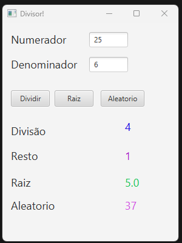
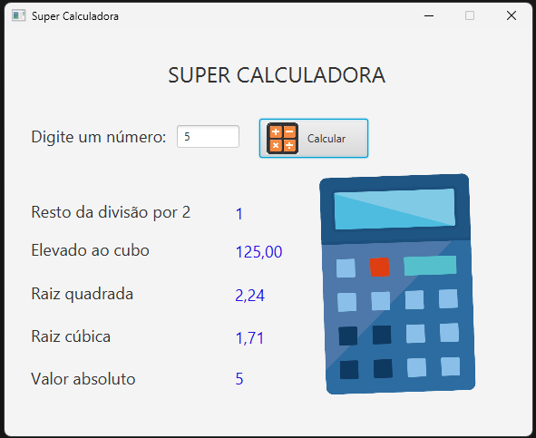

# ✨ Sétima Aula - Operadores Aritméticos e Classe Math em Java

Nesta aula, exploramos os **operadores aritméticos**, **operadores unários**, os principais **operadores de atribuição**, e também a poderosa **classe Math**. Os tópicos abordam desde conceitos fundamentais até funcionalidades avançadas, como geração de números aleatórios e arredondamento de valores.

## ➕ Operadores Aritméticos
Os operadores aritméticos são usados para realizar operações matemáticas com variáveis e valores.

### Operadores
| Operador | Descrição       | Exemplo              |
|----------|------------------|-----------------------|
| `+`      | Adição           | `int soma = 5 + 3;`  |
| `-`      | Subtração        | `int sub = 10 - 4;` |
| `*`      | Multiplicação      | `int prod = 6 * 7;`  |
| `/`      | Divisão          | `int div = 20 / 4;`  |
| `%`      | Resto da divisão | `int resto = 10 % 3;`|

### Exemplo Completo
```java
public class OperadoresAritmeticos {
    public static void main(String[] args) {
        int a = 10;
        int b = 3;

        System.out.println("Adicao: " + (a + b));
        System.out.println("Subtracao: " + (a - b));
        System.out.println("Multiplicacao: " + (a * b));
        System.out.println("Divisao: " + (a / b));
        System.out.println("Resto da Divisao: " + (a % b));
    }
}
```
**Saída:**
```
Adicao: 13
Subtracao: 7
Multiplicacao: 30
Divisao: 3
Resto da Divisao: 1
```

## 📈 Ordem de Precedência
Assim como na matemática, o Java segue a ordem de precedência:
1. Parênteses `()`
2. Multiplicação `*`, Divisão `/`, Resto `%`
3. Adição `+` e Subtração `-`

**Exemplo:**
```java
int resultado = 2 + 3 * 4;
System.out.println(resultado); // Saída: 14
```
Para alterar a ordem, use parênteses:
```java
int resultado = (2 + 3) * 4;
System.out.println(resultado); // Saída: 20
```

---

## 🎙️ Operadores Unários
Os operadores unários atuam em uma única variável.

### Incremento e Decremento
- **Incremento**: Adiciona 1 ao valor da variável.
- **Decremento**: Subtrai 1 do valor da variável.

### Tipos de Incremento/Decremento
| Operador         | Descrição                           |
|------------------|------------------------------------|
| `++var` (Pre)    | Incrementa ANTES de usar o valor.  |
| `var++` (Pós)    | Incrementa APÓS usar o valor.     |
| `--var` (Pre)    | Decrementa ANTES de usar o valor.  |
| `var--` (Pós)    | Decrementa APÓS usar o valor.     |

### Exemplo
```java
int x = 5;
System.out.println(++x); // Pre-incremento: Saída 6
System.out.println(x++); // Pos-incremento: Saída 6
System.out.println(x);   // Valor atual: Saída 7
```

---

## 🔶 Operadores de Atribuição
Os operadores de atribuição permitem modificar variáveis rapidamente:

| Operador | Exemplo       | Equivalente a       |
|----------|---------------|--------------------|
| `+=`     | `x += 2;`     | `x = x + 2;`       |
| `-=`     | `x -= 2;`     | `x = x - 2;`       |
| `*=`     | `x *= 2;`     | `x = x * 2;`       |
| `/=`     | `x /= 2;`     | `x = x / 2;`       |
| `%=`     | `x %= 2;`     | `x = x % 2;`       |

### Exemplo
```java
int x = 10;
x += 5;
System.out.println(x); // Saída: 15
```

---

## 🔢 Classe Math
A classe `Math` oferece métodos matemáticos importantes.

### Constantes
- **`Math.PI`**: Valor de π.

### Métodos Comuns
| Método         | Descrição                           | Exemplo                     |
|-----------------|------------------------------------|-----------------------------|
| **`Math.pow`**  | Eleva um número a uma potência.    | `Math.pow(2, 3)` → `8`      |
| **`Math.sqrt`** | Raiz quadrada.                    | `Math.sqrt(16)` → `4`     |
| **`Math.cbrt`** | Raiz cúbica.                     | `Math.cbrt(27)` → `3`     |

### Arredondamento
| Método          | Descrição                      | Exemplo                 |
|------------------|-----------------------------|-------------------------|
| **`Math.abs`**   | Valor absoluto.             | `Math.abs(-10)` → `10` |
| **`Math.floor`** | Arredonda para baixo.       | `Math.floor(3.7)` → `3` |
| **`Math.ceil`**  | Arredonda para cima.        | `Math.ceil(3.1)` → `4`  |
| **`Math.round`** | Arredonda matematicamente.  | `Math.round(3.6)` → `4` |

---

## 🎲 Gerador de Números Aleatórios
Para gerar números aleatórios, utilizamos o método **`Math.random()`**:

### Exemplo:
```java
int numeroAleatorio = (int) (Math.random() * 10); // Número entre 0 e 9
System.out.println("Numero Aleatorio: " + numeroAleatorio);
```

**Saída (varia):**
```
Numero Aleatorio: 4
```

---
## 🖥️ Aplicativo Prático - Divisor de Valores com JavaFX

Durante a aula, desenvolvemos um **aplicativo simples** utilizando **JavaFX** para fazer a dividisao inteira dos valores, extrair a raiz do numerador e sortear um numero aleatorio . A interface apresenta dois campos para entrada de dados (numerador e denominador), três botões. O primeiro para dividir os valores, o segundo para extrair a raiz do numerador e o terceiro e ultimo gera um numero aleatorio entre 1 e 100. 



### Descrição da Interface
- **Entrada1 (Numerador)**: Um campo de texto para digitar o numerador da divisão.
- **Entrada2 (Denominador)**: Um campo de texto para digitar o denominador da divisão.
- **Botão Dividir**: Aciona a operação de divisão inteira.
- **Botão Raiz**: Aciona a operações de Raiz quadrada.
- **Botão Aleatorio**: Aciona um sorteio randomico de um número inteiro entre 1 e 100.
- **Rótulos de Saída**:
  1. **Divisão**
  2. **Resto**
  3. **Raiz**
  4. **Aleatorio**


### 📄 Código:
Lógica principal do aplicativo:
```java
package com.example.divisor;

import javafx.event.ActionEvent;
import javafx.fxml.FXML;
import javafx.scene.control.Button;
import javafx.scene.control.Label;
import javafx.scene.control.TextField;

public class HelloController {
    @FXML
    private TextField numerador;

    @FXML
    private TextField denominador;

    @FXML
    private Button dividir;

    @FXML
    private Label divisao;

    @FXML
    private Label resto;

    @FXML
    private Button raiz;

    @FXML
    private Label raizTela;

    @FXML
    private Button aleatorio;

    @FXML
    private Label aleatorioTela;

    @FXML
    void actionDividir(ActionEvent event) {
        int numer = Integer.parseInt(numerador.getText());
        int denom = Integer.parseInt(denominador.getText());

        int totalDivisao = numer / denom;
        int totalResto = numer % denom;

        divisao.setText(Integer.toString(totalDivisao));
        resto.setText(Integer.toString(totalResto));
    }

    @FXML
    void actionRaiz(ActionEvent event) {
        int numer = Integer.parseInt(numerador.getText());

        float total = (float) Math.sqrt(numer);

        raizTela.setText(Float.toString(total));
    }

    @FXML
    void actionAleatorio(ActionEvent event) {
        int ale = (int) (Math.random() * 100);
        aleatorioTela.setText(Integer.toString(ale));
    }

}
```

---

## 🛠️ Exercício Proposto: Super Calculadora
Durante a aula de exercícios, foi nos proposto desenvolver uma **super calculadora** utilizando JavaFX. O programa realiza várias operações matemáticas em um valor inserido pelo usuário.



### Descrição da Interface
- **Entrada**: Um campo de texto para digitar o valor.
- **Botão Calcular**: Aciona as operações matemáticas.
- **Rótulos de Saída**:
  1. **Resto da divisão por 2**
  2. **Elevado ao cubo**
  3. **Raiz quadrada**
  4. **Raiz cúbica**
  5. **Valor absoluto**

### Código Principal
```java
package classes.supercalculadora;

import javafx.event.ActionEvent;
import javafx.fxml.FXML;
import javafx.scene.control.Button;
import javafx.scene.control.Label;
import javafx.scene.control.TextField;

public class HelloController {
    @FXML
    private Button calcular;
    @FXML
    private TextField entradaDados;
    @FXML
    private Label resultado01;
    @FXML
    private Label resultado02;
    @FXML
    private Label resultado03;
    @FXML
    private Label resultado04;
    @FXML
    private Label resultado05;
    @FXML
    private Label tela01;
    @FXML
    private Label tela02;
    @FXML
    private Label tela03;
    @FXML
    private Label tela04;
    @FXML
    private Label tela05;

    @FXML
    void actionCalcular(ActionEvent event) {
        tela01.setText("Resto da divisão por 2");
        tela02.setText("Elevado ao cubo");
        tela03.setText("Raiz quadrada");
        tela04.setText("Raiz cúbica");
        tela05.setText("Valor absoluto");

        int numero = Integer.parseInt(entradaDados.getText());
        int divisao = numero % 2;
        double elevado = Math.pow(numero,3);
        double raiz = Math.sqrt(numero);
        double cubica = Math.cbrt(numero);
        int absolute = Math.abs(numero);

        resultado01.setText(Integer.toString(divisao));
        resultado02.setText(String.format("%.2f", elevado));
        resultado03.setText(String.format("%.2f", raiz));
        resultado04.setText(String.format("%.2f", cubica));
        resultado05.setText(Integer.toString(absolute));
    }
}
```

---

## 🎓 O que foi praticado durante a aula
1. Operadores aritméticos: adição, subtração, multiplicação, divisão e resto.
2. Ordem de precedência e uso de parênteses.
3. Incremento e decremento (pré e pós).
4. Uso de **operadores de atribuição**.
5. Métodos avançados da classe **Math**: `Math.sqrt`, `Math.pow`, `Math.cbrt`, `Math.abs`, entre outros.
6. Interface gráfica JavaFX para cálculos interativos.
7. Geração de números aleatórios com **`Math.random()`**.

## 🗂️ Caminhos dos arquivos no repositório
- Pasta: aula_07_Divisor
- **Código Fonte**: `src/main/java/com/example/divisor/HelloController.java`
- **FXML (Interface)**: `src/main/resources/com/example/divisor/hello-view.fxml`
- **Main Application**: `src/main/java/com/example/divisor/HelloApplication.java`
- Pasta: aula_07_Super_Calculadora
- **Código Fonte**: `src/main/java/classes/supercalculadora/HelloController.java`
- **FXML (Interface)**: `src/main/resources/classes/supercalculadora/hello-view.fxml`
- **Main Application**: `src/main/java/classes/supercalculadora/HelloApplication.java`
