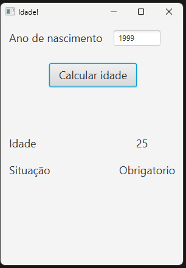

# 🛠️ Oitava Aula: Operadores Lógicos e Relacionais

## 📌 Tópicos Abordados:

### ✅ Operador Ternário
- **O que é?**  
  O operador ternário é uma maneira concisa de escrever expressões condicionais em Java. Ele funciona como uma forma simplificada de usar `if` e `else`.

- **Sintaxe:**
  ```java
  condição ? valor_se_verdadeiro : valor_se_falso;
  ```

- **Exemplo:**
  ```java
  int idade = 18;
  String situacao = idade >= 18 ? "Maior de idade" : "Menor de idade";
  System.out.println(situacao);
  // Saída: Maior de idade
  ```

### ✅ Operadores Relacionais
Os operadores relacionais são usados para comparar dois valores. Eles sempre retornam um valor booleano (`true` ou `false`).

- **Operadores:**
  | Operador | Significado          | Exemplo          | Resultado |
  |----------|----------------------|------------------|-----------|
  | `==`     | Igual a              | `5 == 5`         | `true`    |
  | `!=`     | Diferente de         | `5 != 3`         | `true`    |
  | `>`      | Maior que            | `5 > 3`          | `true`    |
  | `<`      | Menor que            | `2 < 5`          | `true`    |
  | `>=`     | Maior ou igual a     | `5 >= 5`         | `true`    |
  | `<=`     | Menor ou igual a     | `3 <= 7`         | `true`    |

### ✅ Operadores Lógicos
Os operadores lógicos permitem combinar múltiplas expressões booleanas.

- **Operadores:**
  | Operador | Nome           | Descrição                                  | Exemplo                | Resultado |
  |----------|----------------|--------------------------------------------|------------------------|-----------|
  | `&&`     | AND (E)        | Verdadeiro se **ambos** os operandos forem verdadeiros | `(5 > 3) && (7 > 2)`  | `true`    |
  | `\|\|`     | OR (OU)        | Verdadeiro se **pelo menos um** operando for verdadeiro | `(5 > 3) || (2 > 7)`  | `true`    |
  | `!`      | NOT (NÃO)      | Inverte o valor booleano                   | `!(5 > 3)`            | `false`   |
  | `^`      | XOR (OU Exclusivo) | Verdadeiro se **apenas um** dos operandos for verdadeiro | `(5 > 3) ^ (2 > 7)`  | `true`    |

## 🖥️ Exercício Desenvolvido: "Autenticação de Idade"



### ✏️ Lógica Principal:
Este exercício verifica a idade de uma pessoa e determina sua condição de votação:
- **Proibido**: Menores de 16 anos
- **Optativo**: Idade entre 16 e 17 ou maior de 70
- **Obrigatório**: Idade entre 18 e 69

### 🛠️ Interface e Funcionalidade

- **Campos:**
  - Entrada de texto para o ano de nascimento.
- **Botões:**
  - "Calcular Idade": Calcula a idade do usuário e exibe a situação.
- **Labels:**
  - Exibição da idade calculada.
  - Exibição da situação de votação (Proibido, Optativo, Obrigatório).

```java
package classes.idade;

import javafx.event.ActionEvent;
import javafx.fxml.FXML;
import javafx.scene.control.Button;
import javafx.scene.control.Label;
import javafx.scene.control.TextField;
import java.time.LocalDate;

public class Controller {

    @FXML
    private TextField anoNasc;

    @FXML
    private Button calcularIdade;

    @FXML
    private Label idadeTela;

    @FXML
    private Label situacaoTela;

    @FXML
    void actionCalcular(ActionEvent event) {
        int ano = Integer.parseInt(anoNasc.getText());
        int anoAtual = LocalDate.now().getYear();
        int idade = anoAtual - ano;
        idadeTela.setText(Integer.toString(idade));

        if (idade < 16) {
            situacaoTela.setText("Proibido");
        } else if (idade >= 16 && idade < 18 || idade >= 70) {
            situacaoTela.setText("Optativo");
        } else {
            situacaoTela.setText("Obrigatório");
        }
    }
}
```

---

## 🖥️ Exercício Proposto: "Leitor de Pensamentos"


### ✏️ Lógica Principal:
Este aplicativo gera um número aleatório entre 1 e 5 e compara com o palpite fornecido pelo usuário. Utiliza o operador ternário para exibir o resultado.

### 🛠️ Interface e Funcionalidade

- **Campos:**
  - Entrada para o número escolhido pelo usuário.
- **Botões:**
  - "Palpite": Verifica se o número escolhido corresponde ao gerado.
- **Labels:**
  - Exibição da resposta (Acertou ou Errou).

```java
package classes.leitordepensamentos;

import javafx.event.ActionEvent;
import javafx.fxml.FXML;
import javafx.scene.control.Button;
import javafx.scene.control.TextField;
import javafx.scene.control.Label;

public class Controller {

    @FXML
    private Label inicioTela;

    @FXML
    private Label finalTela;

    @FXML
    private TextField numero;

    @FXML
    private Button palpite;

    @FXML
    void comparar(ActionEvent event) {
        int genio = (int) (1 + Math.random() * (6 - 1));
        int palpite = Integer.parseInt(numero.getText());
        String texto = palpite == genio ? "ACERTOU" : "ERROU! Pensei em " + Integer.toString(genio);

        inicioTela.setText("");
        finalTela.setText(texto);
    }
}
```

## 🎓 O que foi praticado durante a aula
- Implementação de lógica condicional usando operadores lógicos e relacionais.
- Uso do operador ternário para simplificação de expressões.
- Construção de interfaces em JavaFX.
- Manipulação de eventos e exibição dinâmica de resultados.

## 🗂️ Caminhos dos arquivos no repositório

### Pasta: `aula_08_Autenticacao_idade`
- **Código Fonte**: `src/main/java/classes/idade/Controller.java`
- **FXML (Interface)**: `src/main/resources/classes/idade/view.fxml`
- **Main Application**: `src/main/java/classes/idade/Application.java`

### Pasta: `aula_08_Jogo_de_advinhacao`
- **Código Fonte**: `src/main/java/classes/leitordepensamentos/Controller.java`
- **FXML (Interface)**: `src/main/resources/classes/leitordepensamentos/view.fxml`
- **Main Application**: `src/main/java/classes/leitordepensamentos/Application.java`
