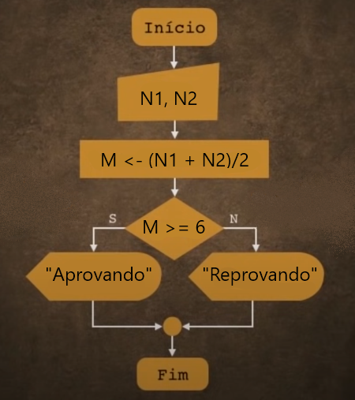
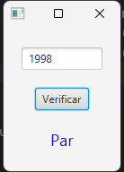
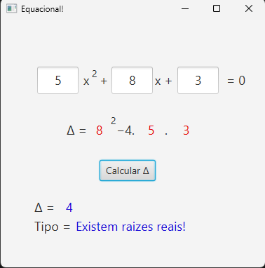

# Nona Aula: Estruturas de Controle (Parte 1)

Nesta aula, abordamos as estruturas de controle e exploramos dois exercícios práticos com exemplos detalhados. Confira o conteúdo abaixo:

## ✨ O que são Estruturas de Controle?
Estruturas de controle são ferramentas fundamentais de programação que controlam o fluxo de execução de um programa com base em condições ou repetições.

### 🚦 **Condicionais Simples e Compostas**

- **Condicional Simples:** Executa um bloco de código se uma condição for verdadeira.
- **Condicional Composta:** Permite definir um caminho alternativo quando a condição não é atendida.

**📌 Exemplo:**
Programa para pedir duas notas, calcular a média e informar a aprovação:

---

### 📊 **Fluxograma do Algoritmo**


### 🔤 **Algoritmo em Portugol**
```portugol
inicio
  real nota1, nota2, media

  escreva("Digite a primeira nota: ")
  leia(nota1)
  escreva("Digite a segunda nota: ")
  leia(nota2)

  media <- (nota1 + nota2) / 2

  se (media >= 6) entao
      escreva("Aprovado!")
  senao
      escreva("Reprovado!")
  fimse
fim
```

### 💻 **Algoritmo em Java**
```java
import java.util.Scanner;

public class Media {
    public static void main(String[] args) {
        Scanner scanner = new Scanner(System.in);

        System.out.println("Digite a primeira nota: ");
        double nota1 = scanner.nextDouble();

        System.out.println("Digite a segunda nota: ");
        double nota2 = scanner.nextDouble();

        double media = (nota1 + nota2) / 2;

        if (media >= 6) {
            System.out.println("Aprovado!");
        } else {
            System.out.println("Reprovado!");
        }
    }
}
```

---

## 💡 Exercício da Aula: Verificar Par ou Ímpar



Este exercício, desenvolvido com JavaFX, verifica se um número inteiro é par ou ímpar.

### 📋 **Descrição da Lógica**
1. O programa solicita a entrada de um número inteiro.
2. Verifica se o número é divisível por 2.
   - Se o resto for zero, o número é par.
   - Caso contrário, é ímpar.
3. Exibe a resposta na interface gráfica.

### 🎨 **Interface**
- Um campo de texto para entrada do número.
- Um botão "Verificar".
- Um label para exibição do resultado ("Par" ou "Ímpar").

### 🔧 **Lógica Principal:**
```java
package classes.parouimpar;


import javafx.event.ActionEvent;
import javafx.fxml.FXML;
import javafx.scene.control.Button;
import javafx.scene.control.Label;
import javafx.scene.control.TextField;

public class HelloController {
    @FXML
    private TextField numero;

    @FXML
    private Label text;

    @FXML
    private Button verificar;

    @FXML
    void actionVerificar(ActionEvent event) {
        int numer = Integer.parseInt(numero.getText());

        if (numer % 2 == 0) {
            text.setText("Par");
        } else {
            text.setText("Ímpar");
        }
    }

}
```

---

## 🧠 Exercício Proposto: Resolver Equações do Segundo Grau



### 📋 **Descrição da Lógica**
1. Entrar com os coeficientes "a", "b" e "c".
2. Calcular o discriminante: **Δ = b² - 4ac**.
3. Determinar a natureza das raízes com base em Δ:
   - Δ > 0: Duas raízes reais distintas.
   - Δ = 0: Uma raiz real (repetida).
   - Δ < 0: Nenhuma raiz real.

### 🎨 **Interface**
- Três campos de texto para entrada dos coeficientes (a, b, c).
- Um botão "Calcular".
- Uma área para exibição do resultado do discriminante e tipo de raízes.

### 🔧 **Lógica Principal**:
```java
package classes.equacional;

import javafx.event.ActionEvent;
import javafx.fxml.FXML;
import javafx.scene.control.Button;
import javafx.scene.control.Label;
import javafx.scene.control.TextField;
import javafx.scene.text.TextFlow;

public class Controller {

    @FXML
    private TextFlow caixaResultado;

    @FXML
    private Label resultado;

    @FXML
    private Label tipo;

    @FXML
    private Button calcular;

    @FXML
    private TextField entradaA;

    @FXML
    private TextField entradaB;

    @FXML
    private TextField entradaC;

    @FXML
    private Label textoA;

    @FXML
    private Label textoB;

    @FXML
    private Label textoC;

    @FXML
    public void initialize() {
        entradaA.textProperty().addListener((observable, oldValue, newValue) -> {
            textoA.setText(entradaA.getText());
        });

        entradaB.textProperty().addListener((observable, oldValue, newValue) -> {
            textoB.setText(entradaB.getText());
        });

        entradaC.textProperty().addListener((observable, oldValue, newValue) -> {
            textoC.setText(entradaC.getText());
        });
    }

    @FXML
    void actionCalcular(ActionEvent event) {
        int a = Integer.parseInt(entradaA.getText());
        int b = Integer.parseInt(entradaB.getText());
        int c = Integer.parseInt(entradaC.getText());

        var total = (b * b) - (4 * a * c);

        if (total > 0) {
            tipo.setText("Existem raízes reais!");
        } else {
            tipo.setText("Não existem raízes reais!");
        }

        caixaResultado.setVisible(true);
        resultado.setText(Integer.toString(total));
    }
}
```

---

## 🏅 O que foi aprendido durante a aula

- Compreensão das estruturas de controle: **Condicionais Simples e Compostas**.
- Comandos **If e else**

## 🗂️ Caminhos dos arquivos no repositório

### Pasta: `aula_09_ParOuImpar`
- **Código Fonte**: `src/main/java/classes/parouimpar/HelloController.java`
- **FXML (Interface)**: `src/main/resources/classes/parouimpar/hello-view.fxml`
- **Main Application**: `src/main/java/classes/parouimpar/HelloApplication.java`

### Pasta: `aula_09_Equacional`
- **Código Fonte**: `src/main/java/classes/equacional/Controller.java`
- **FXML (Interface)**: `src/main/resources/classes/equacional/view.fxml`
- **Main Application**: `src/main/java/classes/equacional/Application.java`
