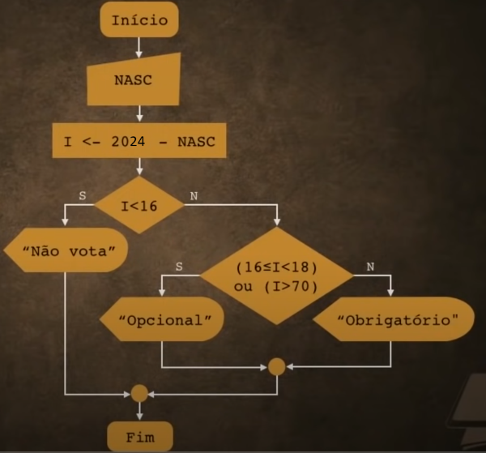
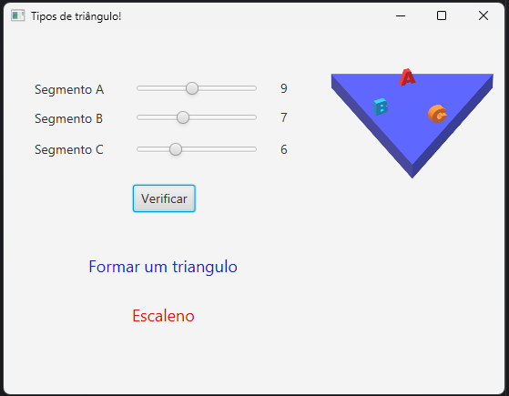

# Décima Aula: Estruturas de Controle (Parte 2)

## 🌟 Estruturas Encadeadas
Estruturas encadeadas permitem que instruções sejam organizadas de forma hierárquica, onde uma decisão leva a outra. São úteis para desenvolver algoritmos que exigem diferentes caminhos de execução dependendo das condições.

### Exemplo: Programa de Verificação de Idade e Condição de Voto

#### 🖼 Fluxograma do Algoritmo


#### ✍️ Algoritmo em Portugol
```plaintext
Inicio
    Escreva("Ano que nasceu: ")
    Leia(ano)

    idade <- 2024 - ano

    Se idade < 16 então
        Escreva("Não vota")
    Senão
        Se idade >= 16 e idade < 18 ou idade > 70 então
            Escreva("Voto opcional")
        Senão
            Escreva("Voto obrigatório")
        FimSe
    FimSe
Fim
```

#### 💻 Algoritmo em Java
```java
import java.util.Scanner;

public class VerificacaoVoto {
    public static void main(String[] args) {
        Scanner scanner = new Scanner(System.in);

        System.out.print("Ano que nasceu: ");
        int ano = scanner.nextInt();
        int idade = 2024 - ano

        if (idade < 16) {
            System.out.println("Não pode votar.");
        } else if (idade >= 16 && idade < 18 || idade > 70) {
            System.out.println("Voto opcional.");
        } else {
            System.out.println("Voto obrigatório.");
        }

        scanner.close();
    }
}
```

---

## 🌟 Estruturas de Múltipla Escolha
São usadas quando há a necessidade de avaliar uma única expressão e executar diferentes blocos de código, dependendo do valor resultante.

### 🔑 Comandos Principais:
- `switch`: avalia uma expressão.
- `case`: define os diferentes valores possíveis.
- `default`: bloco executado caso nenhum dos valores seja atendido.
- `break`: usado para sair do bloco `switch`.

### Exemplo: Programa de Soma de Bônus de Trabalho Baseado nos Anos Trabalhados

#### 🖼 Fluxograma do Algoritmo


#### ✍️ Algoritmo em Portugol
```plaintext
Inicio
    salario <- 1200.00
    Escreva("Digite os anos trabalhados: ")
    Leia(anos)

    Escolha anos
        Caso 1: salario <- salario + 3 * salario / 100
        Caso 2: salario <- salario + 4 * salario / 100
        Caso 3, 4, 5: salario <- salario + 5 * salario / 100
        Caso 6, 7, 8: salario <- salario + 7 * salario / 100
        Caso Contrário: salario <- salario + 10 * salario / 100
    FimEscolha

    Escreva("Seu bônus é: ", salario)
Fim
```

#### 💻 Algoritmo em Java
```java
import java.util.Scanner;

public class Salario {
    public static void main(String[] args) {
        Scanner scanner = new Scanner(System.in);

        System.out.print("Digite os anos trabalhados: ");
        int salario = 1200;
        int anos = scanner.nextInt();
        int bonus;

        switch (anos) {
            case 1:
                salario += 3 * salario/100;
                break;
            case 2:
                salario += 4 * salario/100;
                break;
            case 3, 4, 5:
                salario += 5 * salario/100;
                break;
            case 6, 7, 8:
                salario += 7 * salario/100;
                break;
            default:
                salario += 10 * salario/100;
        }

        System.out.println("Seu bônus é: " + salario);
        scanner.close();
    }
}

```

---

## 🌟 Exercício Proposto: Identificação do Tipo de Triângulo




### 🎯 **Descrição da Lógica**
1. O programa lê 3 valores (lados de um triângulo) usando barras deslizantes.
2. Verifica se os valores formam um triângulo com base na condição: a soma de dois lados deve ser maior que o terceiro.
3. Caso forme um triângulo, identifica seu tipo:
   - **Equilátero**: todos os lados iguais.
   - **Isósceles**: dois lados iguais.
   - **Escaleno**: todos os lados diferentes.
4. Caso não forme um triângulo, exibe uma mensagem informando isso.

### 🎨 **Interface**
- Três barras deslizantes com valores de 0 a 20, cada uma correspondendo a um dos lados do triângulo.
- Um botão "Verificar".
- Duas labels para exibição dos resultados, sendo uma para mostrar se os valores formam um triângulo e a outra para exibir o tipo de triângulo (se for válido).

### 🔧 **Lógica Principal:**
```java
package classes.tipodetriangulo;

import javafx.event.ActionEvent;
import javafx.fxml.FXML;
import javafx.scene.control.Button;
import javafx.scene.control.Label;
import javafx.scene.control.Slider;
import javafx.scene.text.TextFlow;

public class Controller {
    @FXML
    private Slider barraA;

    @FXML
    private Slider barraB;

    @FXML
    private Slider barraC;

    @FXML
    private Button calcular;

    @FXML
    private Label telaA;

    @FXML
    private Label telaB;

    @FXML
    private Label telaC;

    @FXML
    private Label tipo;

    @FXML
    private Label verificador;

    @FXML
    private TextFlow caixaTexto;

    @FXML
    public void initialize() {
        barraA.valueProperty().addListener((obs, oldVal, newVal) -> {
            int a = newVal.intValue();
            telaA.setText(Integer.toString(a));
        });

        barraB.valueProperty().addListener((obs, oldVal, newVal) -> {
            int b = newVal.intValue();
            telaB.setText(Integer.toString(b));
        });

        barraC.valueProperty().addListener((obs, oldVal, newVal) -> {
            int c = newVal.intValue();
            telaC.setText(Integer.toString(c));
        });
    }

    @FXML
    void actionCalcular(ActionEvent event) {
        int a = (int) barraA.getValue();
        int b = (int) barraB.getValue();
        int c = (int) barraC.getValue();

        if (a + b > c && b + c > a && a + c > b) {
            verificador.setText("Forma um triângulo");
            if (a == b && b == c) {
                tipo.setText("Equilátero");
            } else if (a == b || a == c || b == c) {
                tipo.setText("Isósceles");
            } else {
                tipo.setText("Escaleno");
            }
        } else {
            verificador.setText("Não forma um triângulo");
            tipo.setText("");
        }
    }
}
```

---

## 📚 O que Foi Aprendido

1. **Estruturas Encadeadas**:
   - Uso de estruturas de decisão `if-else` e como organizá-las hierarquicamente.
   - Implementação em algoritmos sequenciais e aninhados.

2. **Estruturas de Múltipla Escolha**:
   - Conceito e aplicação de comandos como `switch`, `case`, `default` e `break`.
   - Exemplos práticos para avaliação de expressões fixas.

3. **Prática com Java e JavaFX**:
   - Criação de uma interface gráfica interativa.
   - Utilização de barras deslizantes para entrada de dados dinâmicos.
   - Aplicação de lógica de verificação de triângulos na interface gráfica.

## 🗂️ Caminhos dos arquivos no repositório

### Pasta: `aula_10_TipoDeTriangulo`
- **Código Fonte**: `src/main/java/classes/tipodetriangulo/Controller.java`
- **FXML (Interface)**: `src/main/resources/classes/tipodetriangulo/view.fxml`
- **Main Application**: `src/main/java/classes/tipodetriangulo/Application.java`
